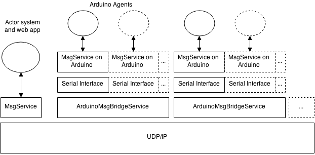
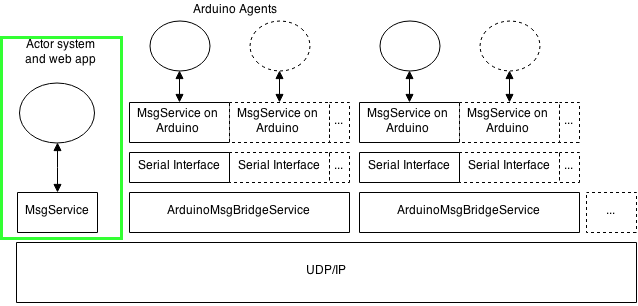
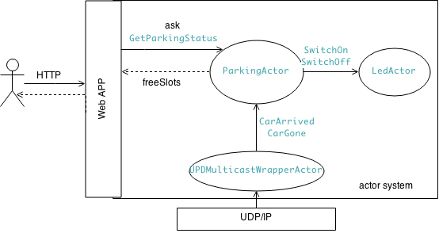
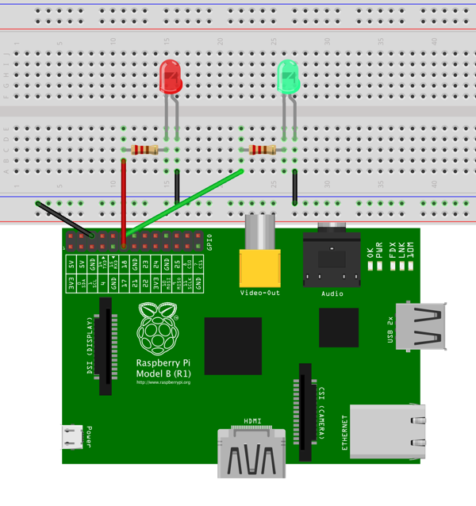
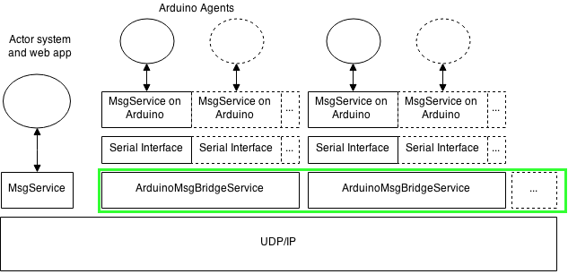
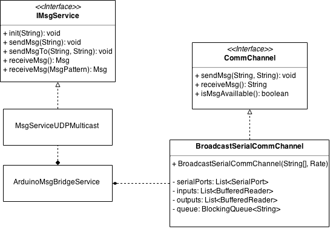
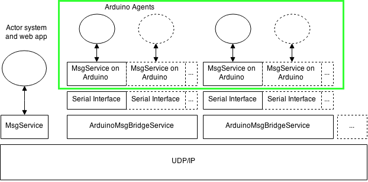
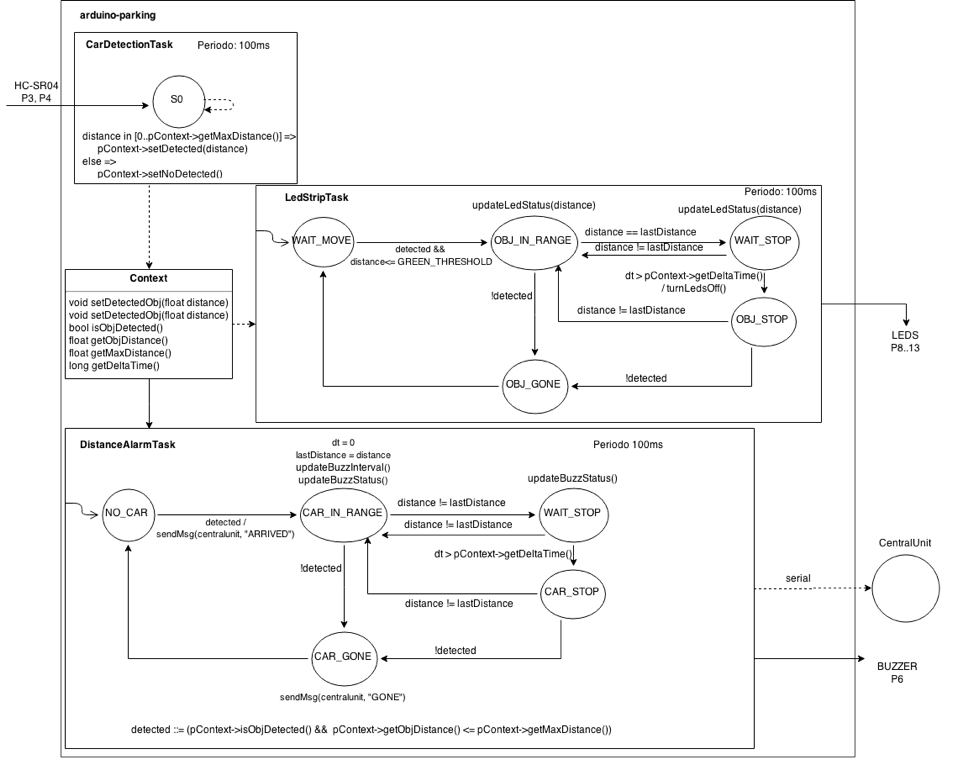
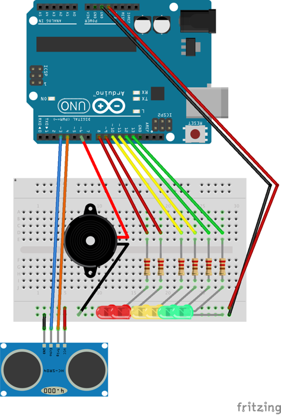
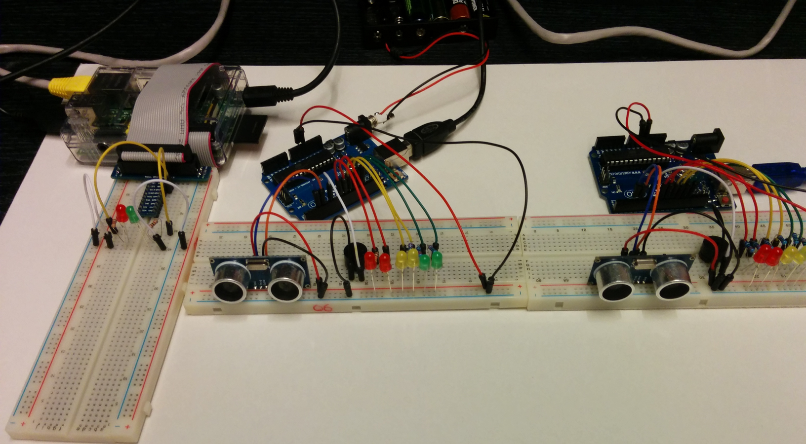

#Project of a parking lot management system

#Index

1. Requirements
1. System architecture
    1. Actor system and web app: play-parking-pi
        1. Hardware
        1. Implementation details
    1. ArduinoMsgBridgeService
        1. Implementation details
    1. Arduino agents: arduino-parking
        1. Structure
            1. Tasks
            1. Tasks diagram
            1. Hardware
            1. Implementation details
1. Up and running

#1. Requirements
The system has to be composed by a **central unit**, that will allow users to query the parking lot status (full/availlable) calling a simple web service.
2 different leds will be connected to the central unit:
- 1 red led, that will be turned on when the parking lot is full
- 1 green led, that will be turned on when the parking lot is not full

The system will be also composed by a (potentially) **high number of small circuits**, one for each plarking lot space, detecting the presence of a single car and interacting with the central unit.
Each circuit will also assist the car drivers in the following ways:
- at the bottom of the parking space is situated a **distance sensor**;
- a **strip of red-yellow-green leds** will give visual feedback to the driver;
- a **buzzer** will alert the driver if he goes too close to the bottom of the parking space.

#2. System architecture



The overall architecture of the system is divided into the following main parts:
- the web app and the actor system, **running on the cental unit** (raspberry pi) and connected to 2 leds via GPIO;
- the MsgService, that intercepts the messeges from UDP/IP and redirect these messages to the actor system (**running on the cental unit**);
- the [arduino-udp-msgservice](https://github.com/AL333Z/arduino-udp-msgservice), that bridge messages from arduinos (coming from one or multiple serial ports) to UDP/IP (**running on the cental unit or in any further intermediate node**);
- the [arduino-parking](https://github.com/AL333Z/arduino-parking) agent, that is placed in each parking space and send messages to the system via its serial port, using a MsgService.

##2.1 Actor system and web app: play-parking-pi



play-parking-pi is a play framework app, with some additional actors:

- `UPDMulticastWrapperActor` is a wrapper on the UPD/IP message service. It maps the messages and forwards `CarArrived` and `CarGone` to the main actor of the system, `ParkingActor`.
```scala
class UPDMulticastWrapperActor() extends Actor
```

- `ParkingActor` is initialized with a fixed number of parking spaces, and keeps memory of system state (thanks to the messages depicted above). When the car park is full, it turns on the red led, otherwise only the green led is turned on.
```scala
class ParkingActor(capacity: Int, redActor: ActorRef, greenActor: ActorRef)
```

- `LedActor` only receives two kind of messages (`SwitchOn` and`SwitchOff`) and it interacts with its GPIO pin.
```scala
class LedActor(pin: Int) extends Actor
```

The following diagram depicts the messages exchanged between each actor.



The interacton with users from HTTP is handled by a single controller (`Application.scala`), that interact with the underlying actor system (akka) using the ask pattern (`?` operator), with the `GetParkingStatus` message, receiving the number of free parking spaces as a response.

###2.1.1 Hardware
The raspberry pi has one green led connected on GPIO1 and one red lead on GPIO0.



###2.1.2 Implementation details
The interactions with leds is handled by the `Led.java` class, introduced during the course (pi4j version).

The MsgService has been wrapped inside the `UPDMulticastWrapperActor`. This is not a standard actor wich receives and process multiple messages. This actor only receives one message (that starts its job) and perform an infinite loop, mapping udp messages in command messages, and forwarding these messages to the system.
Normally this is not a good practice, but the APIs used to receive a msg from UDP are blocking, so wasting one thread here may be reasonable (since akka actors run on a thread pool..).

An alternative to this approach may be using a dedicated thread, that inject messages inside the actor system as they arrive.

##2.2 ArduinoMsgBridgeService

`ArduinoMsgBridgeService` is an example of a message passing bridge that supports comunication from multiple serial ports to Multicast UDP.



The implementation for this component is similar to the implementation presented during the course, with the additional support for multiple serial ports.

###2.2.1 Implementation details



`ArduinoMsgBridgeService` use a `BroadcastSerialCommChannel` to map messages from serial port(s) to UDP multicast.

`BroadcastSerialCommChannel` represent a communication channel (implementing `CommChannel` interface) with the following semantic:
- `receiveMsg` and `isMsgAvailable` msg returns a msg from any of the ports;
- `sendMsg` sends a message to all ports.

##2.3 Arduino agents: arduino-parking



###2.3.1 Structure

The system has 3 main tasks, modelled as *syncronous finite state machine*.

The interaction between each task is mediated by a shared singleton instance of the class `Context`, that contains informations about the current system status.
Since we can consider state transition for each FSM (task) occurring atomically, in accessing `Context` there aren't race conditions at all.
```c++
  // distance to consider a car arrived: 4m
  // delta to consider a car stopped: 3s
  Context* pContext = new Context(4, 3000);
```

####2.3.1.1 Tasks

- **CarDetectionTask**, detecting the presence of a car nearby the distance sensor and comunicating that distance to the system.
```c++
  Task* t0 = new CarDetectionTask(3, 4, pContext); // trig at pin 3, echo at pin 4
  t0->init(100);                                   // 100ms period
```

- **LedStripTask**, that reacts to the presence of a car nearby the sensor turning on and off a led strip (the number of leds turned on is inversely proportional to the distance of the car from the sensor). The led strip starts turning on when the car is at a distance of 1m. All led are turned on when the distance is less of 15cm.

```c++
  int leds[] = {13, 12, 11, 10, 9 , 8};             // array of pins for led strip
  Task* t1 = new LedStripTask(leds, 6, pContext);
  t1->init(100);                                    // 100ms period
```

- **DistanceAlarmTask**, that reacts to the presence of a car nearby emitting a sound (with a buzzer) that is related to the distance of the car and sending a message to the serial port when:
  - a car is `ARRIVED`
  - a car is `GONE`
```c++
  Task* t2 = new DistanceAlarmTask(6, pContext);  // buzzer at pin 6
  t2->init(100);                                  // 100ms period
```

The priority of each task is implicitly determined by the order in which they are added to the scheduler, in the `setup` method.

####2.3.1.2 Tasks diagram



###2.3.1.3 Hardware


###2.3.1.4 Implementation details
For the interaction with leds has been re-used the `Led` class implementation.

For the interaction with the buzzer, a `Buzzer` class has been introduced, with only two methods:
```c++
  void startBuzzing();
  void stopBuzzing();
```

`MsgService`, `Scheduler`, `Task` and `Timer` classes has been re-used too.

##3. Up and running

- connect one or more arduino with [arduino-parking skecth](https://github.com/AL333Z/arduino-parking) via usb to a pc, a raspberry or both

- launch [a message bridge](https://github.com/AL333Z/arduino-udp-msgservice/tree/master) for each pc/raspberry connected to one or more arduinos.

- clone or download the play-parking-pi
- `cd <your-play-parking-pi-folder>`
- change `Global.scala`, to configure the number of parking slot (default is 2, with 2 arduinos)
- `play dist` or `sbt dist` or `activator dist`
- unzip and move the folder to raspberry pi
- cd `your folder on raspberry/play-parking-pi`
- `chmod +x bin/play-parking-pi`
- `sudo ./bin/play-parking-pi -J-Xms64M -J-Xmx128M`
- open your browser to `<your-raspberry-ip>:9000`


